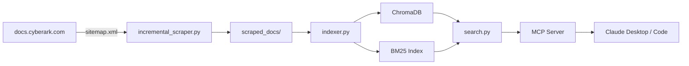

# Documentation Style Guide

## Voice and Tone

Write as a senior engineer talking to a competent peer. Assume Python fluency. Do not assume CyberArk product knowledge.

- Use "you" for instructions: "Run the scraper" not "The user should run the scraper"
- Use present tense: "The indexer creates chunks" not "The indexer will create chunks"
- Be direct. Cut filler words. "Configure the MCP server" not "In order to configure the MCP server, you'll need to..."
- Technical accuracy over friendliness. If something is complex, say so. Do not oversimplify.

## Formatting

### Headings

- H1 (#) only for document title
- H2 (##) for major sections
- H3 (###) for subsections
- Never go deeper than H3. If you need H4, restructure.

### Code Blocks

Always specify language:

```bash
python -m cyberark_rag index
```

```python
from cyberark_rag.config import settings
```

```yaml
ollama:
  endpoint: http://localhost:11434
```

```json
{
  "mcpServers": {
    "cyberark-rag": { ... }
  }
}
```

### Terminal Examples

Show the command AND realistic output so users know what success looks like:

```bash
$ python incremental_scraper.py --dry-run
Found 18,247 URLs in https://docs.cyberark.com/sitemap.xml
Total valid URLs: 17,893
Pages to scrape: 42
  Would scrape: https://docs.cyberark.com/conjur-cloud/Latest/en/Content/Conjur/conjur-authn-k8s.htm
  Would scrape: https://docs.cyberark.com/privilege-cloud-standard/Latest/en/Content/PASIMP/PVWA-Overview.htm
  ... and 40 more
```

Use `$` prefix for commands to distinguish from output.

### Tables

Use tables for reference data (env vars, parameters, error codes). Keep cells concise.

| Variable | Default | Description |
|---|---|---|
| `CYBERARK_RAG_DOCS` | `./scraped_docs` | Path to scraped documentation |

### Admonitions

Use blockquotes with bold labels for warnings and notes:

> **Note:** The embedding model downloads on first run (~80 MB for MiniLM, ~1.3 GB for BGE-large).

> **Warning:** Deleting `chroma_db/` requires a full re-index which takes 5-15 minutes.

> **Tip:** Use `--dry-run` before any scrape to preview what will change.

### Links

- Internal links: relative paths (`[Configuration](configuration.md)`)
- External links: full URLs (`[Anthropic Contextual Retrieval](https://www.anthropic.com/news/contextual-retrieval)`)
- Link to specific sections: `[BM25 Parameters](configuration.md#bm25-parameters)`

## Terminology

Use these terms consistently. Do not alternate.

| Use This | Not This |
|---|---|
| scraped docs, scraped documentation | crawled pages, downloaded docs |
| index, search index | database, vector store |
| chunk | segment, fragment, piece |
| contextual prefix | context snippet, preamble |
| hybrid search | combined search, dual search |
| MCP server | tool server, plugin |
| MCP tool | endpoint, function, handler |
| Claude Desktop | Claude app, Claude UI |
| Claude Code | Claude CLI, Claude terminal |
| query expansion | term expansion, synonym expansion |
| intent detection | intent classification, query classification |
| re-ranking | reranking, re-sorting |
| embedding model | vector model, encoder |
| BM25 | keyword search, lexical search |
| Reciprocal Rank Fusion, RRF | score merging, rank merging |

### CyberArk Product Names

Always use the display name on first reference, then the short form:

| First Reference | Subsequent |
|---|---|
| Conjur Cloud (Secrets Manager SaaS) | Conjur Cloud |
| Conjur Enterprise (Self-Hosted) | Conjur Enterprise |
| Privilege Cloud | Privilege Cloud |
| Privileged Access Manager (Self-Hosted) | PAM |
| Endpoint Privilege Manager (EPM) | EPM |
| Dynamic Privileged Access (DPA) | DPA |
| Secrets Hub | Secrets Hub |
| Secure Workload Access | SWA |
| Identity Security Platform | Identity |

### File Paths

- Use forward slashes even on macOS/Linux docs
- Use `~/` for home directory paths
- Use `./` prefix for project-relative paths
- Never use absolute paths like `/Users/joe.garcia/...`

## Diagrams

Use Mermaid syntax for diagrams. Claude Code renders these in markdown previews.



Keep diagrams simple. If it needs more than 15 nodes, split into multiple diagrams.

## Document Length

- README.md: 150-250 lines (scannable, links to details)
- Getting started: 200-300 lines (complete but focused)
- Architecture: 200-400 lines (thorough)
- Configuration: 300-500 lines (exhaustive reference)
- Guides: 150-300 lines each
- Troubleshooting: 200-400 lines (grows over time)
- Contributing: 150-250 lines
- Changelog: as needed

## What NOT to Document

- Internal implementation details that only matter to the code (document in docstrings instead)
- Obvious Python patterns ("how to create a virtual environment" beyond the one-liner)
- Anthropic API details (link to Anthropic docs instead)
- CyberArk product features (link to docs.cyberark.com instead)
- Speculative future features (only document what exists)
