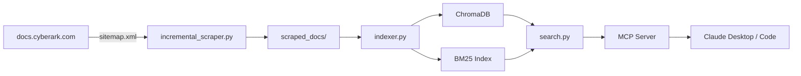
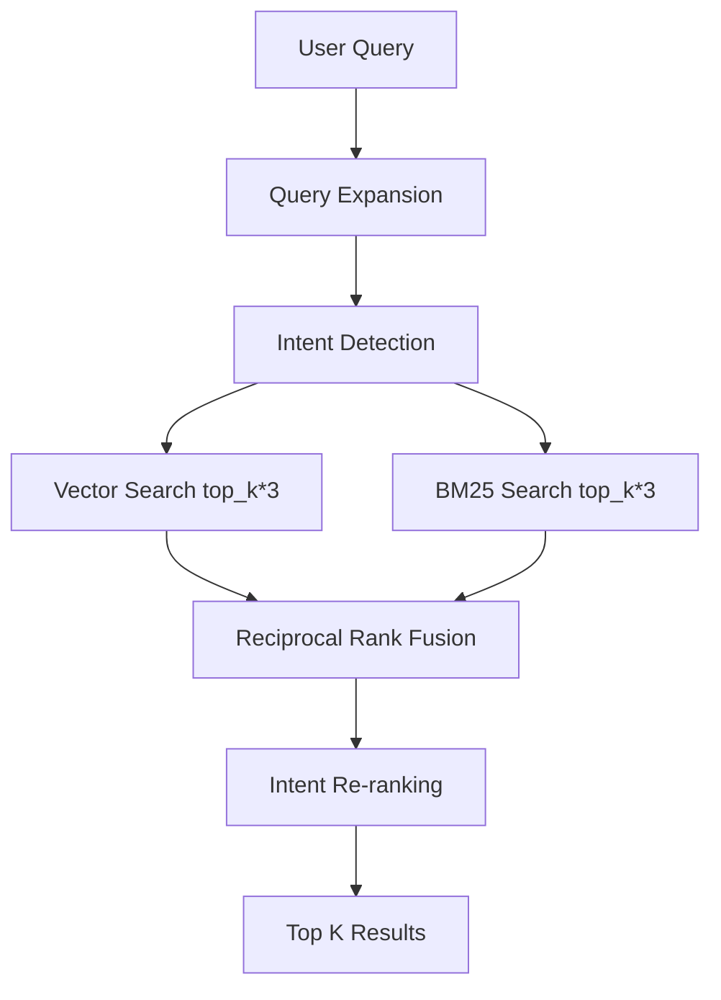

# Architecture

System design for contributors and advanced users.

## System Overview



| Component | Responsibility |
|---|---|
| `incremental_scraper.py` | Discovers and fetches documentation pages from docs.cyberark.com via sitemap parsing |
| `indexer.py` | Chunks documents, adds contextual prefixes, embeds into ChromaDB, builds BM25 index |
| `search.py` | Orchestrates the search pipeline: expansion, intent detection, hybrid search, re-ranking |
| `mcp_server.py` | Exposes search as 4 MCP tools over stdio transport for Claude integration |

## Data Pipeline

### Scraper

The incremental scraper (`incremental_scraper.py`) fetches documentation pages from docs.cyberark.com:

1. Parses `sitemap.xml` (handles sitemap index recursion up to depth 3)
2. Compares sitemap `<lastmod>` timestamps against stored state in `scraper_state.json`
3. Fetches only pages where content has changed since last run
4. Extracts title and content from HTML (main/article/content containers)
5. Saves each page as a JSON file: `{url, title, content, scraped_at}`

Incremental updates typically complete in 2-10 minutes. A full scrape of ~19,000 pages takes 2-4 hours.

### Indexer

The indexer (`cyberark_rag/indexer.py`) transforms scraped JSON into a searchable index:

1. **Load**: Reads all `*.json` files from `scraped_docs/`
2. **Chunk**: Splits text using paragraph-aware boundaries with tiktoken tokenizer (800 tokens per chunk, 100 token overlap)
3. **Contextualize**: Prepends metadata-derived prefixes via `contextual_chunker.py`
4. **Classify**: Assigns content type (procedural, conceptual, reference, code-example) via `content_classifier.py`
5. **Embed**: Generates vector embeddings using sentence-transformers, stores in ChromaDB
6. **BM25**: Builds keyword index from the same contextualized text, saves to `bm25_index.pkl`

### Chunk Size Rationale

The default of 800 tokens balances precision and context. Smaller chunks (256-512) return more precise snippets but lose surrounding context. Larger chunks (1024+) preserve more context but dilute relevance scores. Anthropic's contextual retrieval research validates this range.

### Contextual Prefixes

Each chunk receives a metadata-derived prefix before embedding. This improves retrieval by 35% (per [Anthropic's research](https://www.anthropic.com/news/contextual-retrieval)) because chunks like "Revenue grew 3%" become self-contained:

```
From CyberArk Conjur Cloud documentation, page titled 'Kubernetes Authenticator',
in the section about Configuration Steps, (version Latest). The Conjur Kubernetes
Authenticator enables workloads running in Kubernetes to authenticate...
```

The original unprefixed text is preserved in metadata as `original_text` and returned in search results.

## Search Pipeline



### Query Expansion

The `QueryExpander` loads 80+ expansion groups from `query_expansions.yaml`. When a query token matches a group, related terms are added at 0.7x weight (vs 1.0x for originals). Example:

- Query: "configure spire kubernetes"
- Expanded: "configure spire kubernetes spiffe svid k8s openshift"

Includes typo correction: "priviledge" maps to "privilege", "authentification" maps to "authentication".

### Intent Detection

The `QueryIntentDetector` classifies queries into 5 intent types using regex patterns:

| Intent | Example Query | Boost Target |
|---|---|---|
| how-to | "how to configure conjur authn-k8s" | Procedural content (2.0x) |
| explanation | "what is SPIFFE identity" | Conceptual content (2.0x) |
| reference | "conjur CLI command reference" | Reference content (2.0x) |
| troubleshooting | "PVWA error 401 access denied" | Code examples (2.0x) |
| general | "conjur authentication" | No boost (1.0x all) |

### Hybrid Search

Two parallel search paths run for each query:

1. **Vector search**: Encodes query with sentence-transformers, queries ChromaDB by cosine similarity (returns `top_k * 3` candidates)
2. **BM25 search**: Tokenizes query (preserving hyphenated terms like "privilege-cloud"), scores against inverted index (returns `top_k * 3` candidates)

Results merge via **Reciprocal Rank Fusion**:

```
score(d) = (vector_weight / (k + rank_vector + 1)) + (bm25_weight / (k + rank_bm25 + 1))
```

Defaults: `vector_weight=0.7`, `bm25_weight=0.3`, `k=60`. Deduplicates by `(url, chunk_index)` tuple.

### Content Classification

The `ContentClassifier` assigns each chunk a primary type based on regex patterns and URL signals:

| Type | Signals |
|---|---|
| procedural | Step indicators ("Step 1:", "Navigate to"), numbered lists |
| conceptual | Overview language ("provides", "enables"), architecture descriptions |
| reference | Table markers, API endpoints, parameter lists |
| code-example | Code blocks, `curl` commands, YAML/JSON snippets |

URL paths like `/reference/` and `/tutorial/` also influence classification.

### Intent Re-ranking

After fusion, results are re-ranked by multiplying each result's score by the intent boost factor for its content type. This ensures a "how to" query ranks procedural content above reference tables.

## Module Dependency Graph

```
mcp_server.py
    └── search.py
        ├── query_expansion.py ── query_expansions.yaml
        ├── query_intent.py
        ├── hybrid_search.py
        ├── bm25_index.py
        ├── product_aliases.py ── product_aliases.yaml
        └── (ChromaDB)

indexer.py
    ├── contextual_chunker.py
    ├── content_classifier.py
    ├── bm25_index.py
    ├── product_aliases.py
    └── config.py

config.py ── (env vars)
logging_config.py ── (stderr handler)
```

Singleton patterns are used for expensive resources: `QueryExpander`, `QueryIntentDetector`, `ProductAliasResolver`, and `DocumentSearcher` all lazy-initialize on first use and reuse the same instance.

## MCP Server

The MCP server (`cyberark_rag/mcp_server.py`) uses FastMCP with Pydantic input models:

- **Transport**: stdio (JSON-RPC over stdin/stdout)
- **Logging**: All output to stderr (stdout is reserved for protocol messages)
- **Lazy loading**: The `DocumentSearcher` initializes on the first tool call, avoiding startup cost when tools are not yet needed
- **Tool annotations**: All tools declare `readOnlyHint=True`, `destructiveHint=False`, `idempotentHint=True`
- **Pydantic schemas**: Input validation for `search_docs` and `get_command_example` tools

## Data Footprint

| Component | Size | Notes |
|---|---|---|
| `scraped_docs/` | ~176 MB | ~19,378 JSON files |
| `chroma_db/` | ~1.2 GB (MiniLM) / ~3.8 GB (BGE-large) | Depends on embedding model |
| `bm25_index.pkl` | ~50-100 MB | Pickled inverted index |
| Embedding model | ~80 MB (MiniLM) / ~1.3 GB (BGE-large) | Downloaded on first run |
